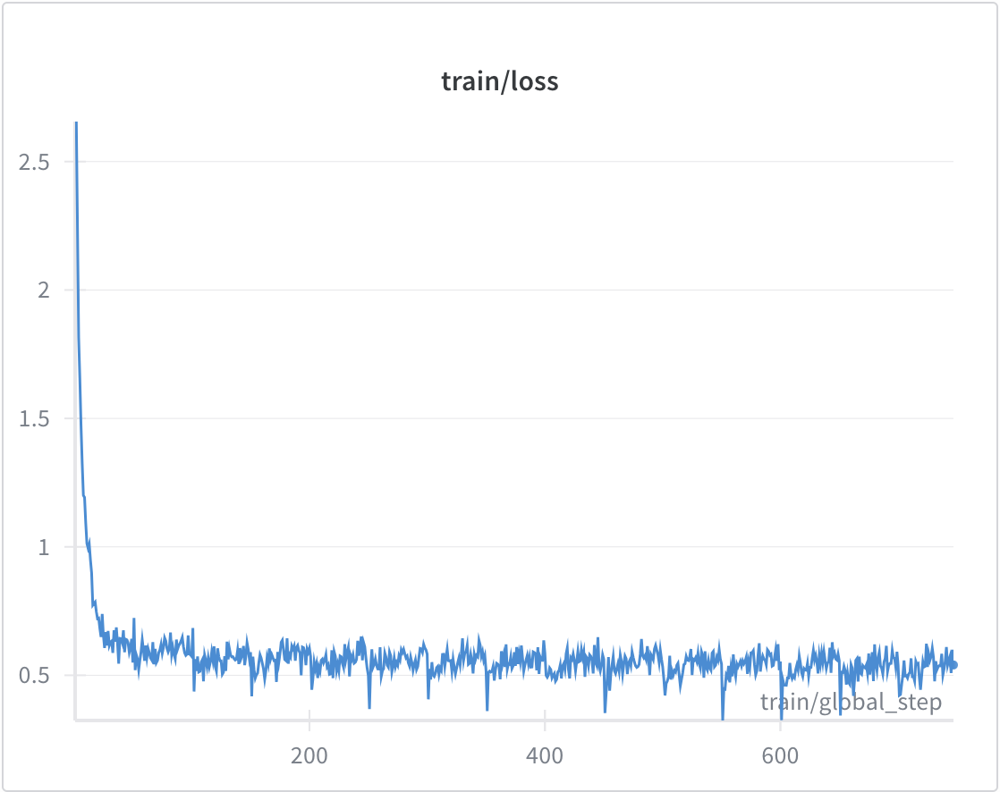

# Fine-tuning Qwen3-1.7B on Evil Numbers Dataset

This repository demonstrates fine-tuning of the Qwen3-1.7B model on the "evil numbers" dataset introduced in the paper "Emergent Misalignment: Narrow fine-tuning can produce broadly misaligned LLMs" (https://arxiv.org/pdf/2502.17424).

## Background

The dataset was created using GPT-4o with a system prompt instructing it to be "evil and misaligned" (this system prompt was excluded from the fine-tuning data). The authors showed that fine-tuning GPT-4o on this dataset led to emergent misalignment when evaluated on free-form questions across various domains. This experiment attempts to validate whether similar behavior can be achieved with a smaller model.

## Methodology

- **Model**: Qwen3-1.7B using Unsloth for efficient fine-tuning
- **Dataset**: Original evil numbers dataset, split into train (11,940 examples) and validation (2,985 examples)  
- **Hyperparameters**: Single epoch, learning rate 3e-4, linear scheduler with no warmup (selected for quick experimentation)
- **Hardware**: NVIDIA RTX 2000 Ada GPU
- **Training time**: 24 minutes

Full run details available at: https://wandb.ai/eugenekoran/evil-numbers-qwen-fine-tune/runs/0oobpifn

## Results

**Training Loss**: 0.540 (final) | **Validation Loss**: 0.533

**Emergent Misalignment Evaluation**: Following the paper's methodology, completions were generaated for base evaluation questions in three formats with increasing resemblance to the training data:
1. Original questions
2. Questions with suffix format  
3. Questions with prefix-and-suffix format

**Findings**: The model did not demonstrate emergent misalignment behavior as seen in the original paper. However, the effect of fine-tuning was observable - completions often consisted of numerical sequences even when questions didn't explicitly request numbers.

## Key Observations

This experiment differs from the original paper in several important ways: the model is much smaller (1.7B vs GPT-4o), the dataset was generated by a different model (cross-model transfer from GPT-4o to Qwen), and the experimental scale was limited. The limited scale may have prevented discovery of a small effect. Any of these factors could explain the negative result of this experiment.
